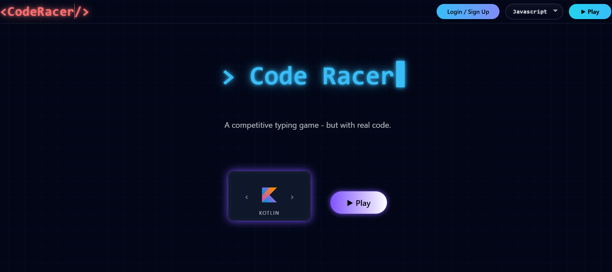
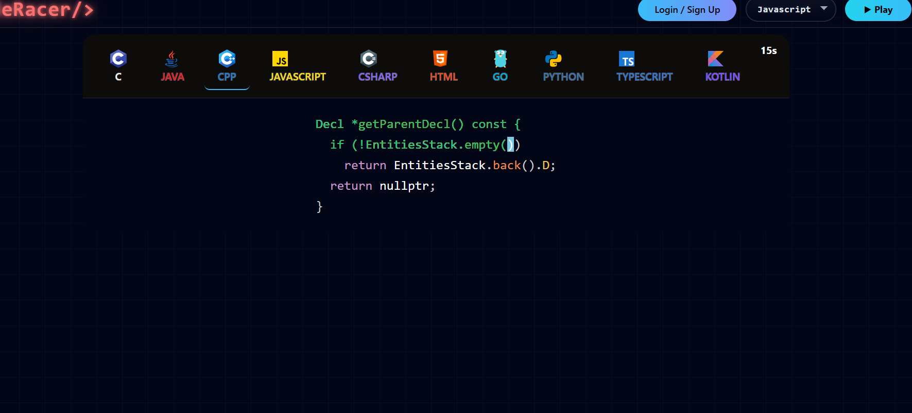
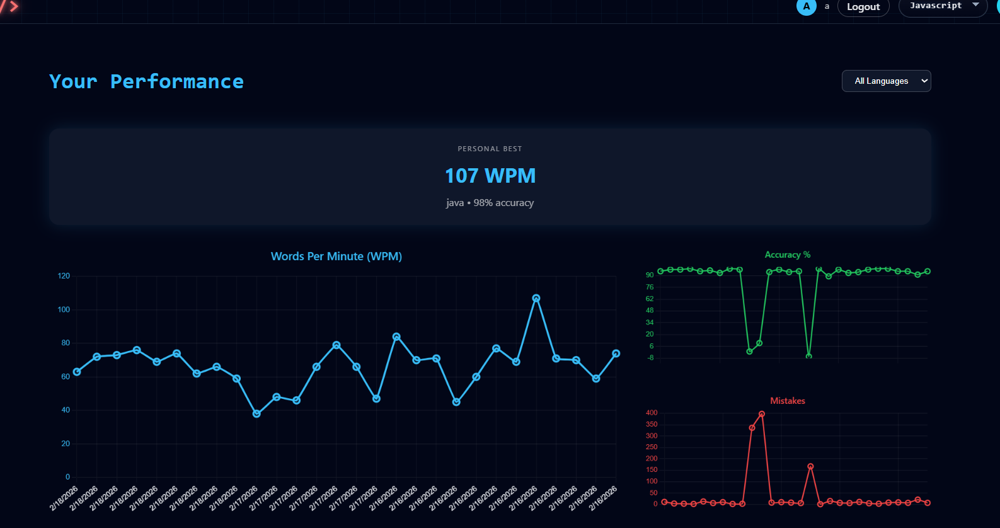
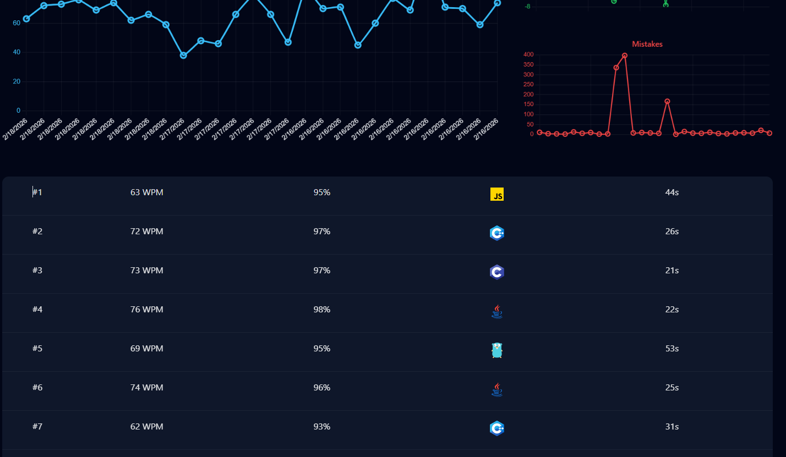

# ⚡ Code Racer

A full-stack code typing game built with **Spring Boot + React** that allows users to practice typing real code snippets across multiple programming languages while tracking their performance over time.

Users can improve typing speed, monitor accuracy, analyze mistakes, and review match history through an interactive analytics dashboard.

---

## 🏠 Home

Select a language and start practicing instantly.

---

## 💻 In-Game Experience

- Real-time syntax highlighted code
- Live timer
- Caret tracking
- Mistake detection
- Rolling WPM tracking

---

## 📊 Performance Metrics

Users can analyze their improvement over time with:

- WPM performance trend
- Accuracy percentage chart
- Mistakes chart
- Personal best tracking

---

## 📜 Match History

Track recent games with:

- WPM
- Accuracy
- Mistakes
- Language
- Duration

---

## 🛠 Tech Stack

### Frontend

- React (Hooks)
- Chart.js (animated performance charts)
- Prism.js (syntax highlighting)
- Axios
- Responsive CSS (Grid & Flexbox)

### Backend

- Spring Boot
- Spring Security
- JWT Authentication
- JPA / Hibernate
- PostgreSQL

---

## 🎯 Project Focus

This project demonstrates:

- Real-time input handling
- Performance analytics visualization
- Secure full-stack integration
- Responsive dashboard design
- Stateful UI engineering
- Clean REST API architecture

---

Built to combine interactive frontend engineering with secure backend design and performance tracking.
